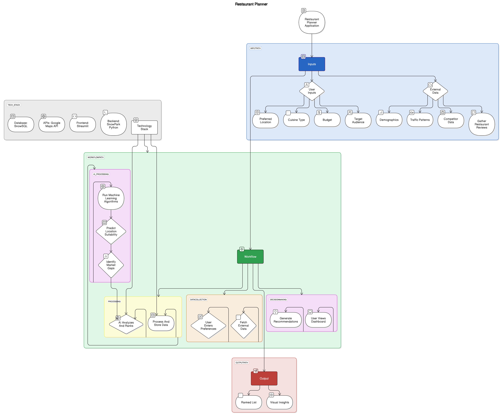

### Team: E - Divyani
- Individual Use cases for the selection
1. Divyani Pendam: Carbon footprint tracker specified for coal mines - (Rank 2)
2. Shriraj Pandhare: Location-Based Restaurant Recommendation System Using Demographics, Traffic Patterns, Popularity, and User Preferences - (Rank 1)
3. Mahesh Shastrakar: AI Based Telemedicine (A Complete Health Platform using AI tools) - (Rank 3)
4. Om Rahudkar: Smart Dustbin with Advance Smell Detection -(Rank 4)

### Team E Final Use Case: Location-Based Restaurant Setup Recommendation System Using Demographics, Traffic Patterns, Popularity, and User Preferences
- Short Name: RestaurantPlanner.

- Description: RestaurantPlanner is an AI-driven system that helps users identify the type of restaurant to establish, leveraging demographic data, traffic patterns, restaurant popularity, and user-defined preferences. The system provides actionable insights and ranking-based recommendations to guide decision-making.
  
- Persona: Primary Users: Entrepreneurs, Restaurant Owners, Franchise Managers, etc.
  
- Painpoint:
  1. Lack of data-driven decision-making tools for restaurant location selection.
  2. Difficulty in analyzing multiple factors like demographics, traffic flow, and existing restaurant competition.
  3. Limited ability to predict the success of a restaurant in a given location.
  4. Manual and time-intensive market research processes.

- Justification:
  1. A restaurant's success is highly dependent on its location and how well it aligns with local consumer preferences.
  2. RestaurantPlanner integrates AI and data analytics to optimize the decision-making process.
  3. By providing comprehensive, data-backed recommendations, it reduces the uncertainty and risk involved in selecting a restaurant location.

- Benefits/Value:
  1. Data-Driven Insights: Provides recommendations based on demographics, traffic data, and popularity trends.
  2. Customization: Tailors suggestions to specific user preferences (e.g., type of cuisine, target customer base).
  3. Competitive Analysis: Identifies gaps in the local restaurant market and highlights opportunities.
  4. Efficiency: Reduces the need for extensive manual market research, delivering quick and actionable insights.
  5. Predictive Modeling: Uses AI to predict the potential success of a restaurant at a given location.

- Current State:
  1. Entrepreneurs and restaurant owners primarily rely on manual market research, real estate consultations, and publicly available data, which can be time-consuming and lack predictive accuracy.
  2. Existing tools like Google Maps and Yelp provide basic insights but do not integrate multi-factor predictive analytics, requiring users to analyze fragmented data from various sources.

- Proposed State:
  1. A centralized platform that integrates multiple data sources (demographics, traffic, existing restaurant landscape) and utilizes AI/ML models for predictive analysis.
  2. Users can input specific preferences and receive tailored insights, location rankings, and detailed reports to aid their decision-making process.

- Solution:
  - Data Aggregation: Collects and integrates data on demographics, traffic patterns, restaurant reviews, and competitor analysis.
  - AI-Driven Recommendations: Uses machine learning to analyze user preferences and predict optimal restaurant types and locations.
  - User-Friendly Dashboard: Interactive visualizations, heatmaps, and ranking tables for easy interpretation.
  - Agile Approach: Fast adaptation to meet time-to-market trends as to evolve successfully in the market.

- Technologies: 
1.  Frontend : Streamlit Visualization
2.  Backend : SnowPark Python, Cortex AI/ML (Models)
3.  Databases : SnowSQL
4.  APIs : Google Maps API

- Use Case Methodology: SIPOC
  1. Supplier : User 
  2. Input : Location data, user preferences
  3. Process : Data collection -> AI-driven analysis -> Recommendation generation -> Visualization
  4. Output : Ranked restaurent setup recommendation with detailed insights
  5. Customers : Entrepreneurs, Restaurant Owners, Franchise Managers, etc.

- User Stories
  1. As a restaurant investor, I want data-driven insights on location selection so that I can minimize risks and maximize profitability.
  2. As an entrepreneur, I want to compare multiple location options based on real-time analytics so that I can choose the best spot for my restauran
  3. As a market analyst, I want an AI-generated ranking of restaurant locations so that I can provide better recommendations to my clients.
  4. As a franchise manager, I want predictive success metrics for new locations so that I can make strategic expansion decisions.

- WorkFlow

